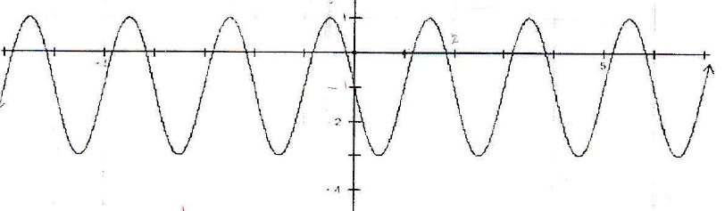
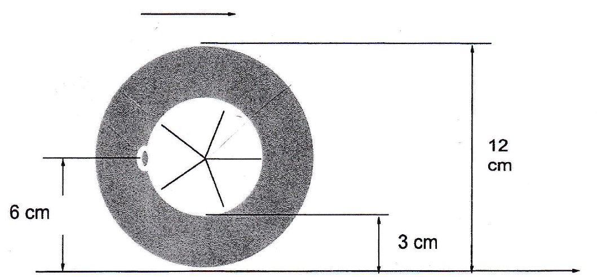

# Chapter 6 Unit Test – Sinusoidal Functions

---

## Question 1

State $y = \cos x$ in terms of sine.

---

## Question 2

For the trig function $f(x) = -2 \cos(3x - 120) - 1$, determine:

- (a) The phase shift
- (b) The amplitude
- (c) The period
- (d) The axis $y =$
- (e) The max value
- (f) The min value

---

## Question 3

Sketch one period of the following functions. Include a scale and label all important points and the axis. (Important points are at every quarter of a period)

**(a)** $f(x) = -2 \sin(x) + 2$

**(b)** $g(x) = \cos(2(x + 45))$

---

## Question 4

Write the following function in terms of sine:

$$f(x) = -2 \cos(3x - 120) - 1$$

---

## Question 5

**(a)** State the:
   - (i) Period
   - (ii) Amplitude
   - (iii) Equation of the axis

**(b)** State a function in terms of cosine that represents this graph:

---

## Question 6

The diameter of a car's tire is 60 cm. While the car is being driven, the tire picks up a nail.

**(a)** Draw a graph and write a trig function that describes the height of the nail above the ground as a function of the distance the car has traveled after picking up the nail.

**(b)** How high above the ground is the nail after the car has traveled 1.2 km?

---

## Question 7

Above is a diagram of a wheel rolling to the right on the floor. The valve stem is on the inside of the wheel, indicated by the dot that is 6 cm above the ground.

**(a)** Determine the sinusoidal function that describes the height of the valve stem above the ground as a function of distance that the wheel has moved forward. (Include a graph)

**(b)** How high is the valve stem above the ground when the wheel has rolled 60 cm?

**(c)** If the wheel is moving forward at a speed of $24\pi \text{ cm/s}$, then determine the sinusoidal function that describes the height of the valve stem above the ground as a function of time.

