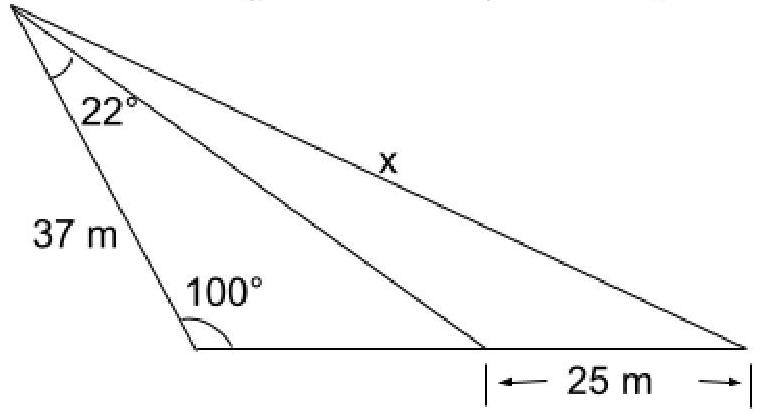
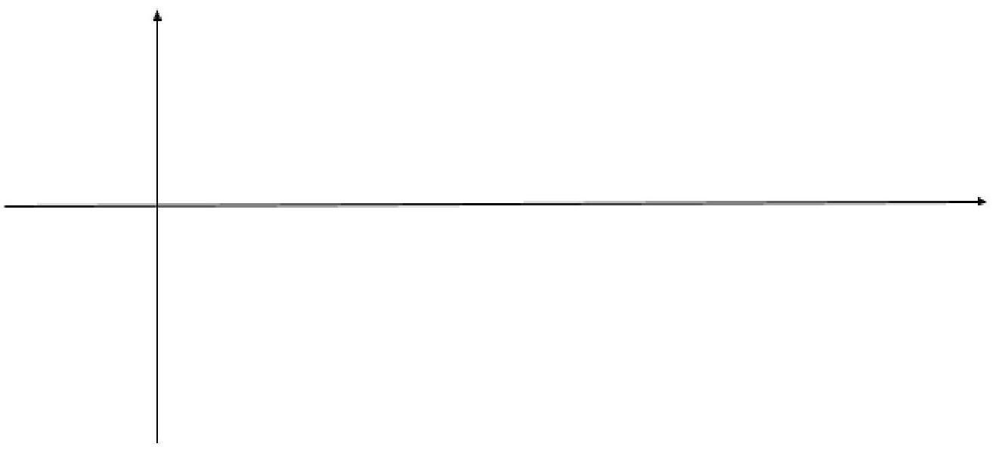

Here is the markdown version of your "MCR3U Exam Jan 2023.pdf" after OCR:

---

# Canterbury High School MCR 3U Final Examination

**Friday, January 27, 2023**  
**Time:** 9:30-11:30 AM  
**Teacher:** Mr Hughson

## Instructions

1. There are 6 pages in this exam. Make sure all are present.
2. Non-graphing calculators are permitted. (No sharing)
3. Exact values are required except where indicated.
4. All solutions are to be done on the exam itself.
5. Scrap paper is provided for rough work and will not be graded.
6. Read all instructions and questions carefully before you begin each part.

---

## PART A: Answer in space provided. Only the answer is needed. (37 marks)

1. If $f(x)=-2 \sqrt{2 x-1}+5$, determine $f(5)$.
2. For the function $y=-2(x+3)^{2}+7$, state the following:
    - (a) The vertex
    - (b) The \(y\)-intercept
    - (c) The max
    - (d) Domain
    - (e) Range
3. For the function $y=\frac{3}{x-1}+2$
    - (a) What is the parent function?
    - (b) What is the vertical stretch factor?
    - (c) What is the horizontal translation?
4. State the inverse of
    - (a) $f(x)=x-3$
    - (b) $f(x)=3x$
    - (c) $f(x)=x^{2}$
5. Simplify the following:
    - (a) $\frac{3x}{5x}=$
    - (b) $\frac{x(x-3)^{2}}{x^{2}(x-3)}=$
6. Factor
    - (a) $5 m^{2}-25 m=$
    - (b) $m^{2}-4 m-5=$
    - (c) $2 x^{2}+3 x-9=$
7. For the function $f(x)=-2x^{2}-8x$ state
    - (a) The \(y\)-intercept
    - (b) The direction of opening
    - (c) The zeros (\(x\)-intercepts)
    - (d) The vertex
8. Reduce the radical $\sqrt{12}$
9. State the exact value of $\cos 60^{\circ}$
10. State the related acute angle for $300^{\circ}$
11. For terminal arm created by the point $P(-5,-6)$
    - (a) State the exact value of $\cot \theta$
    - (b) The value of the related acute angle (1 decimal place)
    - (c) The value of the principal angle \(\theta\) (1 decimal place)
12. For the trig function $y=-3 \cos (10(x+9)) + 2$
    - (a) The phase shift
    - (b) The amplitude
    - (c) The period
    - (d) The axis
    - (e) The max
    - (f) The min
13. Simplify with positive exponents
    - (a) $\frac{3x^{2}}{27x}$
    - (b) $\frac{(4x)^{2}}{2x^{6}}$
    - (c) $\left(\frac{3x^{-1}}{x^{3}}\right)^{-2}$
    - (d) $\frac{\sqrt[3]{x^{4}}}{\sqrt{x}}$

---

## PART B: Provide complete solutions. Clearly indicate your final answer.
Express answers using exact values unless instructed otherwise. (41 marks)

1. Simplify $\frac{m^{2}-4m-5}{5m^{2}-25m} \div \frac{m^{2}+3m+2}{15m^{2}}$
2. Solve the following quadratic equations using the best method.
    - (a) $2x^{2}-9x-5=0$
    - (b) $2x^{2}+2.7x-5.1=0$
3. Simplify $(7\sqrt{2} + \sqrt{3})(7\sqrt{2} - \sqrt{3}) =$

4. Nadia and Leah are playing baseball. Nadia pitches the ball to Leah and Leah hits the ball. $t$ seconds after the ball is hit, its height in metres is given by  
$h(t) = -5t^{2} + 20t + 0.8$. Determine the following:
    - (a) How high was the ball above the ground when it was hit?
    - (b) What is the maximum height of the ball?
    - (c) When will the ball hit the ground?

5. Determine the length of \(x\) in the diagram below. (Answer to one decimal place.)  

6. For $\cos(A) = -\frac{2}{3}$, where $0^{\circ} \leq A \leq 360^{\circ}$,
    - (a) Sketch the possible positions of the terminal arms for angle \(A\) on the Cartesian plane
    - (b) Determine the exact values of \(\tan(A)\)
    - (c) Determine the related acute angle and all values for \(A\) to 1 decimal place.

7. 
(a) State the pointwise formula for the transformation from the parent function in 4(b) to $y = 2 \times 3^{-2(x+1)} - 3$ and use it with at least 3 key points.  \((x, y)\)

(b) Graph and label the function \(y = 2 \times 3^{-2(x+1)} - 3\). (Identify at least 2 key points and the asymptote on the graph.)  
 

8. (a) State the pointwise formula for the transformation from $y = \cos(x)$ to $y = -3 \cos(10(x+9)) + 2$, and use it with at least 3 key points of $y = \cos(x)$.  
    \((x, y)\)
    - (b) Sketch one period of \(y = -3 \cos(10(x+9)) + 2\). Include a scale and label all important points and the axis.  
    